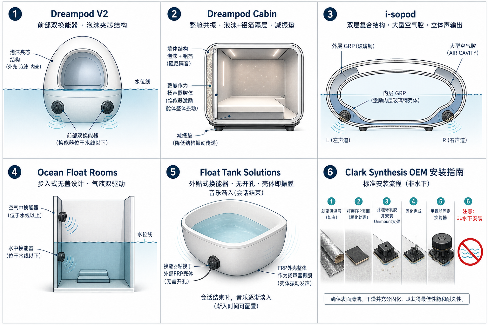
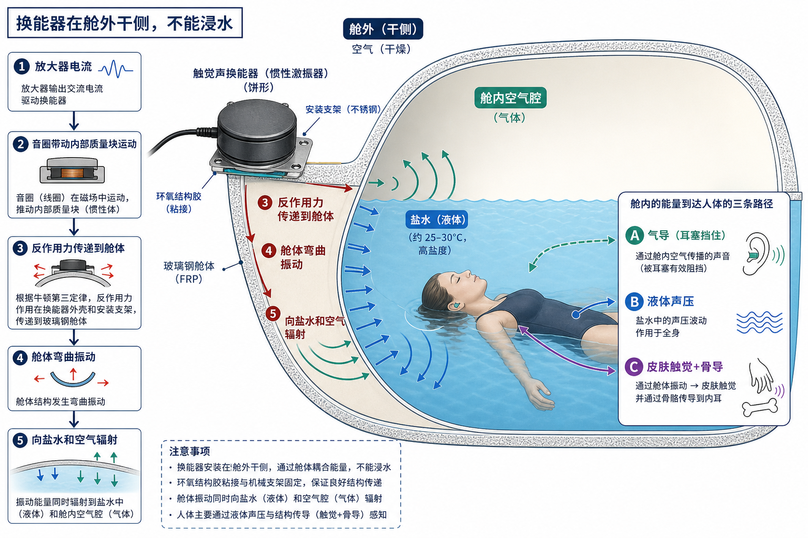
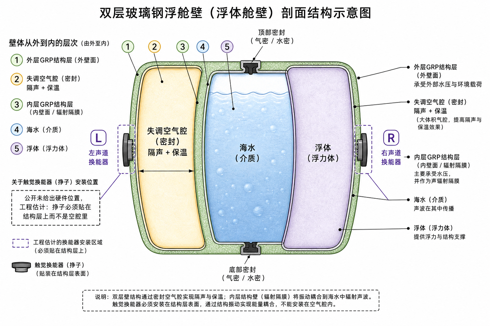
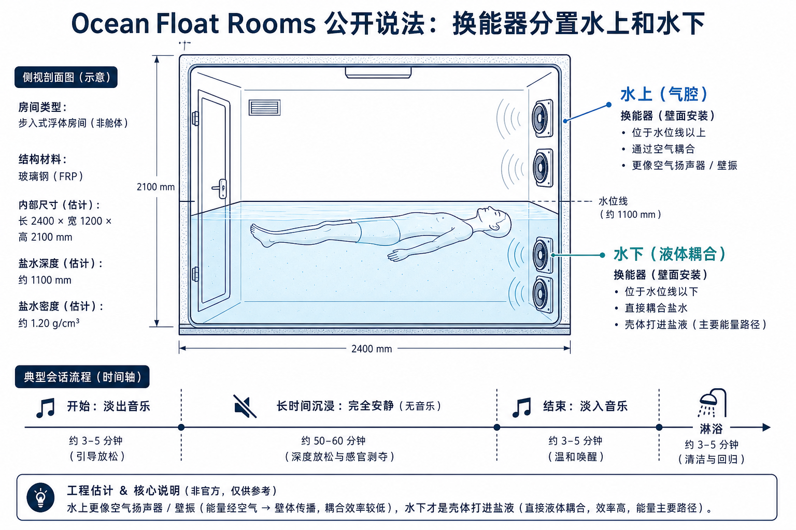
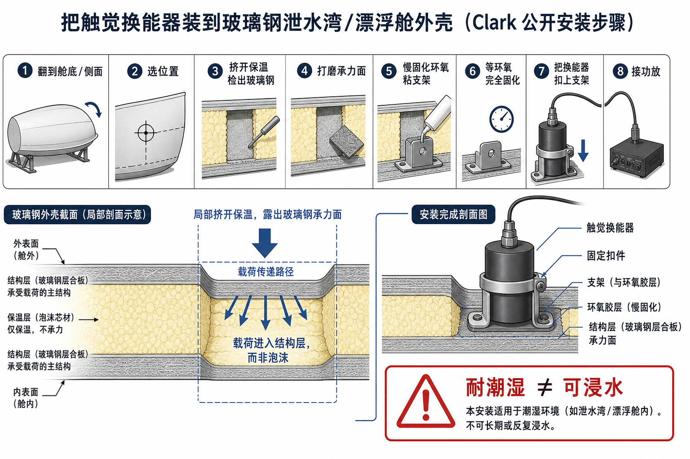

# 躯体微振 + 骨传导：产品研发方案（合并稿）

内部工程文件｜2026-09-05  
给：结构 / 电气 / 点点控 / 内容 / 验收。装在 FA-D、FA-O 上。

**这是产品研发文件，不是专利申请。** 上篇写我们要在 FA-D / FA-O 上做成什么样；下篇把行业壳体传声的公开做法拆开，方便抄安装和零件，不要和我们的用途混在一起。

行业主流是：舱壁当喇叭，戴耳塞还能听见引导，结束淡入代替敲门。  
我们要做的是：舱壁微振打躯体 + 骨传导耳机打头部，两路可分辨。零件可以同类，验收不是听清字。

下篇标记：**厂家原文**＝能点到网页；**工程补全**＝官网没写细，按壳体振动常规反推，样机阶段用实测改。

---

# 上篇 · 我们要做的

## 1. 要交付什么，不要交付什么

### 交付

1. **体通道：** 舱体外侧（干侧）两只全频触觉换能器，把舱壁当振源。液体把微振动送到皮肤和浅层组织。默认关。
2. **头通道：** 防水骨传导耳机，会话中可戴。独立功放或独立 DSP 通道，不和舱壁共用一个全频信号。
3. **点点控四档**，默认 0：

| 档 | 对内名字 | 客人得到什么 |
|---|---|---|
| 0 | 深静音 | 换能器断电，耳机不发振 |
| 1 | 体通道 | 只有舱壁微振，不戴耳机也可以 |
| 2 | 双通道 | 舱壁微振 + 骨传导耳机 |
| 3 | 结束唤醒 | 两路从无到有淡入，代替敲门；头通道可只走提示，不强求微振 |

### 明确不要交付

- 把舱壁当 Hi-Fi，追求「不戴耳机也能听清播客」——那是上一版的错用途，本方案不当主指标。
- 水下浸水喇叭、水听器会话闭环。
- 浴缸那套「听一套、触一套、四象限扫振动中心」。
- 默认开着盖泵噪声。
- 把 40 Hz、theta、泛音、音疗写成功能名。

现有主机正面的「音乐舒缓系统」仍是空气喇叭。漂中戴耳塞后气导基本无效。本方案**不靠它**完成体通道；头通道走骨传导，也不靠它。

---

## 2. 迷走假说：接触点选神经，频率不选神经

这一节是设计依据。写清楚，是为了避免用错零件、用错频率、对外说错话。

### 2.1 一句话

**频率不能把能量「专门打到躯体」或「专门打到头部」。** 能量进哪一条传入，看换能器贴在哪、耦合介质是什么。频率只决定同一块组织里哪一类感受器更敏感。

所以「舱体一个频率打身体、耳机一个频率打头、两个频率合起来激活迷走」——作为产品体验可以做两条通路；作为神经科学主张，站不住。

### 2.2 迷走传入实际从哪进

和本产品有关的，只有这几条，不要混：

| 路径 | 感受器在哪 | 本舱里会不会被碰到 |
|---|---|---|
| 耳甲艇 / 耳甲腔的迷走耳支（ABVN） | 外耳特定皮肤 | **只有作动器压在耳甲艇或耳屏上才会。** 普通骨传导耳机压在颞骨、颧骨或乳突上，走的是耳蜗，不是这条。 |
| 颈段迷走 | 喉两侧深处 | 体表微振到不了。要电、磁或专门压在颈前。US11324916 已经把颈+耳的电/磁/触觉可穿戴写过。 |
| 心肺容量感受器 | 胸腔大血管和心房 | **漂浮本身就会牵张这条**（Gauer-Henry）。这是泡在液体里就有的，不是换能器发明的。文献还显示热中性浸水与平躺的副交感增强可以差不多。 |
| 皮肤和深部机械感受器 | 全身 | 舱壁微振主要打在这里（帕西尼、梅斯纳）。这是躯体感觉，不是迷走干。 |

结论：

- **体通道**交付的是全身刚过阈的微振。它不是「躯体迷走刺激器」。
- **头通道如果用市售骨传导耳机**，交付的是颅骨振动 → 耳蜗（听见）以及乳突/颞部的局部触觉。它**不是**经皮耳迷走（taVNS）。
- 若内部坚持「头通道必须打 ABVN」，零件要改成**压在耳甲艇的振动触头**，不能再用乳突骨传导耳机凑数。那是另一套模具、卫生和夹持问题。本文件第一版仍按你们说的骨传导耳机做，但验收指标不写「已激活迷走」。

骨传导枕头对外已经在讲「振动经颅骨到内耳、作用于副交感」。那是竞品话术，不是我们可以独占的机制，也不是我们可以写进专利的效果。

### 2.3 人身上三套感受器，仍然要分开设计

同一套振动会同时打到触觉、听觉、前庭。假说再大，前庭也不能当卖点。

| 感受器 | 大致敏感带 | 本方案怎么用 |
|---|---|---|
| 梅斯纳 | 约 10–50 Hz | 体通道可以碰到一点「浅表拂」 |
| 帕西尼 | 约 40–400 Hz，峰值约 200–250 Hz | **体通道主力**：深部轻嗡。不要锁死某一个「治疗赫兹」 |
| 耳蜗 | 约 20 Hz–20 kHz | 头通道骨导会听见。体通道低频也会经水漏进颅骨，两路会串 |
| 耳石 / 前庭 | 大约 20 Hz 以下、幅度一大 | **切掉。** 摇舱、胸闷、恶心 |

中性浮力会放大还剩下的皮肤信号：陆地上靠椅背，振动从接触斑进来；漂里没有靠背，全身湿皮肤泡在液体里。默认电平必须比浴缸、水床更保守。

### 2.4 工程上选用哪两段频谱（只用于调校，不写铭牌、不写对客）

不要用「舱体基频 + 泛音」。泛音是谐波（2f、3f、4f）。身体上的 2f、3f 正好跨进可闻区，液体又会把舱壁振动漏进颅骨，两路会融成一个音色，**独立性立刻丢掉**。

推荐（本舱实测后可以挪，但逻辑不要改）：

| 通道 | 频谱 | 为什么 |
|---|---|---|
| 体 / 舱壁 | **25–80 Hz** 宽带隆隆或粉红，不要单音。高通切掉约 20 Hz 以下 | 落在躯体触觉带，躲开前庭；不要用 4–8 Hz「theta」、不要用 40 Hz 当功能名 |
| 头 / 骨传导 | **两路里选一条，不要两条一起当默认** | 见下 |

头通道二选一：

1. **只做头部触觉、尽量少让人听成音乐：** 大约 150–400 Hz 窄带，且与体通道不要成整数倍关系（不要 30 Hz 配 60 Hz、80 Hz）。
2. **要兼做结束提示或慢语：** 300 Hz–4 kHz 语音带。这是听觉，更不是迷走。

两路之间留空档（大约 80–150 Hz 不要两边都灌能量），减少融合成一件乐器。

**互调：** 两路同时开，换能器非线性会生出和频差频。差频如果掉进可闻区或前庭带，人会觉得多了一个谁也没放的声音。电平必须低，组合要在盐液里听过。

即使用户觉得「40 刚好在帕西尼带里」，产品上也不要把 40 写成模式名、说明书示例或宣传数字。

### 2.5 液体耦合仍然重要，但目的是体感，不是听清字

盐液特性阻抗和软组织接近，空气差约一千倍。所以：

- 空气喇叭：能量卡在气–皮肤界面。戴耳塞后听不见，也几乎没有体感。
- 舱壁经水：能量能进浅层组织，全身同时有微振。

「戴耳塞还能听见」只是体通道的**副作用**（低频会经水走骨导）。本方案不把它当主验收。引导词若需要听清，走头通道，不要逼舱壁当中频喇叭。

同一驱动电压，清水和盐液的体感会不一样。**量产 EQ 必须在运营浓度盐液里标定。**

### 2.6 骨传导耳机在舱里的真实约束

- 夹持力：陆地靠头的重量和头箍。中性浮力下头不压任何东西，头箍本身是一个持续触觉刺激，和深静音打架。夹太松耦合差，夹太紧破坏 REST。
- 盐：耳塞现在是为了防盐。骨传导不堵耳道，盐雾仍会进耳廓和换能器缝。要按游泳骨传导那一级防水选，会话后按 SOP 冲洗消毒。
- 串扰：体通道开着时，乳突加速度计会看到舱壁那一路。头通道并不是「干净的头部专用通道」，水把两路耦在一起了。调校时要测：只开体、只开头、两路同开，三条乳突曲线。

---

## 3. 对内怎么写、对客怎么说、什么不许说

**实验记录只用物理句子：**

- 体通道：舱壁加速度 → 胸腹体表加速度刚过阈，液面不起可抱怨的皱。
- 头通道：乳突或颞部加速度；若兼听觉，另记复述率。
- 串扰：只开体时乳突上还有多少舱壁相关分量。
- 不记「迷走是否激活」。没有注册临床试验和对照，那个句子没有测量定义。

**对客可以说：**

- 身体会有很轻的低频振动；头部可以另戴一只防水骨传导。
- 想完全安静，可以关掉。
- 结束时振动和提示会自己过来，不用敲门。

**任何场合都不许说：** 刺激/激活迷走、细胞共振、频率疗愈、40 Hz、音疗、已验证改善睡眠或焦虑、骨传导助眠数据。界面和说明书里同样不许出现这些词。

商业材料若要讲自主神经，只用已经定过的口径：为副交感占优创造条件、恢复环境。不要把双通道写成治疗模块。

---

## 4. 系统怎么构成

```
点点控
  ├─ 体通道 DSP（高通约 20 Hz、低通约 80–100 Hz、限幅、淡入、使能）
  │     → 功放 → 舱外两只触觉换能器
  └─ 头通道 DSP（与体通道电气隔离；频谱按 2.4 选定）
        → 骨传导耳机（座舱消毒充电；或一次性耳垫 + 可消毒主体）
```

两路**独立节目**，不要把同一条立体声的低音送舱壁、高音送耳机这种家用分频来冒充「两个部位」。家用分频的目的是听一首歌；我们的目的是两条机械通路。

深静音：两路 DSP 静音，并且切断体通道功放使能。急停切断两路。

会话中没有水听器闭环。盐液里标定一次，固化成预设。

---

## 5. 接到 FA-D / FA-O 上

| 机型 | 舱体约尺寸 | 液量（手册口径，以铭牌为准） |
|---|---|---|
| FA-D | 2350 × 1400 × 1400 mm | 有效约 400 L，运行重量约 800 kg 级 |
| FA-O | 3000 × 1800 × 1600 mm | 约 800 L |

三分体：舱体 / 智能主机 / 储液箱。换能器只在舱外干侧。DSP、功放进主机柜。

- **玻璃钢：** 去保温、打磨、环氧粘厂家支架，力进结构层，不能耗在泡沫里。
- **亚克力：** 不要砂穿、不要只点粘。大面积底板把力铺开；胶兼容亚克力、耐湿热。

体通道摆位（阶段 B 之后可改）：两只关于纵轴对称；对应设计液面以下、靠近躯干投影，不要装在头的正下方（正下方更容易把体通道漏进颅骨）。不要装在泵、管路、门铰链上。舱脚必须隔振。

头通道：耳机存放在主机侧消毒盒；线材或蓝牙在盐雾里都要按游泳级选型。蓝牙在水下不可靠，优先本地存储或舱内近场方案，具体由电气定，但不要假设客人自己的手机在漂中还能连。

---

## 6. 样机买什么

按一台 FA-D。规格意图，不是量产定点。

### 体通道

| 件 | 规格意图 | 例子 |
|---|---|---|
| 全频触觉换能器 ×2 | 干侧、耐潮湿；低频要够，中频不必为听清字优化 | Clark Synthesis AW339 一类；交期不行用同系列加防潮罩，不能浸水 |
| 支架 + 慢固化环氧 | 厂家 Unimount；亚克力另做底板 | 随换能器 |
| DSP | ≥2 出给体通道，可存预设 | miniDSP 2x4 HD 一类 |
| 功放 | 4 Ω 稳定，有使能 | 不要带「自动低音增强」 |
| 舱脚隔振 | 按运行重量 | 橡胶/钢分层垫 |

### 头通道

| 件 | 规格意图 | 例子 |
|---|---|---|
| 防水骨传导 | IP68 级、可消毒、夹持可调；不要普通蓝牙运动耳机 | 游泳用骨传导（如 OpenSwim 一类）只作样机对照，量产要另选可消毒结构 |
| 独立 DSP / 衰减器 | 与体通道分频独立 | 可与体通道同一台 DSP 的另外两出 |

若下一版改打耳甲艇：另开模具，本 BOM 的乳突骨传导不要直接改名当 taVNS。

### 实验室测量（不装进交付品）

| 件 | 用来证明 |
|---|---|
| 加速度计 ≥4 | 舱壁、胸腹体表、乳突、耳机外壳 |
| 水听器 | 只用于标定串扰和液中声压，不当会话闭环 |
| 液面：激光位移或高速摄像 | 涟漪是否可感 |
| 信号源 | 两路可独立的扫频 / 粉红 / 窄带 |

Dayton BST-1：只用来让内部的人对比「只有抖」。不要当量产体通道。

不要买：浸水喇叭、「40 Hz 疗愈」模块、游戏椅套装当交付件。

---

## 7. 实验和调校

原则：先分清两路，再看串扰，再上人。能做清水对照的都做。每一步留波形。

安全：漏电保护、急停切断、盐液里不放通电换能器、电平从低加。内部受试不是临床试验，**不设迷走、HRV、焦虑量表作为合格判据。**

### 阶段 A · 小板

换能器胶接是否传力。扫频 10 Hz–200 Hz 即可（体通道不再为 8 kHz 语音服务）。共振峰后面要压。

### 阶段 B · 空舱不注液

舱壁网格加速度、楼板泄漏。隔振垫有/无对照。

### 阶段 C · 清水到设计液位

固定电压：只开体 / 只开头 / 两路同开。

要拿到：

1. 电压 → 胸腹加速度（体通道主指标）
2. 电压 → 乳突加速度（串扰 + 头通道）
3. 电压 → 液面波高
4. 两路差频、和频有没有掉进可闻或前庭带

### 阶段 D · 盐液到门店运营密度

把 C 全部重做。出厂预设只用盐液档。

### 阶段 E · 内部受试（效果验收）

条件随机：关 / 只体 / 只头 / 双通道。口述只问：

- 身体有没有刚能察觉的轻嗡；
- 头部振动和身体是不是两件事，还是融成一个；
- 有没有摇、晕、痒、怕、头箍不可忍；
- 水面有没有皱。

**做成的判据：** 只体时胸腹刚过阈、波高不超过抱怨线；双通道时受试能指出「身上一路、头上一路」；关档本底不比改造前差。

复述引导词**不是**本方案的主判据。若档 3 要提示，另测头通道复述，不要拿舱壁听字来验收。

### 阶段 F · 会不会搞坏安静

验收电平下泵开/关，测气腔声、液面、邻室。变差就降功率或改安装。

---

## 8. 怎样算做到设备上了

1. **体通道刚过阈、涟漪在阈下。**
2. **双通道时两路可分辨**，不是一个音色。
3. **不摇舱。** 头部很低频加速度低于不适线。
4. **深静音还在。**
5. **不漏楼。**
6. **急停切断两路。**
7. **出厂 EQ 是盐液档。**
8. **点点控默认关。** 对外话术只允许第 3 节。
9. **不把迷走、40 Hz、音疗写进界面文案。**

---

## 9. 内容怎么配

- 体通道：无旋律的低频纹理，或极慢的包络。不要鼓点砸液面。
- 头通道：若只要振，用与体通道不成谐波的窄带；若要提示，用慢语，不要歌单。
- 开场可很短，必须能回到静音。不要整场塞满。
- 两路时间上可以同起同止，但频谱不要做成一首歌的分频。

---

## 10. 分工

| 工作包 | 做什么 | 完成物 |
|---|---|---|
| 结构 | 玻璃钢/亚克力安装、隔振、布线、耳机消毒存放 | 安装图 + 一台 FA-D |
| 电气 | 两路 DSP、使能、急停、漏电、湿区 | 接线图 + 联锁可演示 |
| 点点控 | 四档、默认关、倒计时淡入 | 可操作界面（无迷走/疗字） |
| 调校 | 阶段 A–D、盐液预设、串扰表 | EQ + 波形 |
| 内容 | 体通道纹理、头通道提示 | 两轨成品 |
| 验收 | 阶段 E–F + 第 8 节 | 签字表 |

先做 FA-D。FA-O 单独走 C–E。

---


---

# 下篇 · 行业壳体传声（对照，用来抄作业）

行业把舱壁当喇叭。和上篇共用同一类干侧换能器，用途不同：他们要听得见，我们要身上一路、头上一路。

## 0. 先看总图

六家公开能对上的结构，其实是同一条物理链的六种外壳：



共同信号链：

```
节目源（MP3 / 会话软件淡入）
  → 功放（通常 4 Ω、百瓦级）
  → 触觉换能器（惯性振子，贴在壳体结构层上）
  → 舱壁当喇叭盆
  → 盐液把振动送到皮肤和颅骨
  → 人：听见（骨导）+ 感到（体表）
```

Clark 自己还写过另一条路：把水下喇叭直接泡进盐水。漂浮业主流**不走这条**，因为盐蚀和开孔。下文分开写。

---

## 1. 共同物理（核实原理 + 工程估计）



### 1.1 触觉换能器不是扬声器（核实）

Clark Synthesis 对 TST 的定义：把电信号变成**振动能量**，不是靠纸盆推空气。他们把「触觉声」说成：皮肤摸到的振动 + 骨传导听到的声音。见 [What is Tactile Sound?](https://clarksynthesis.com/faq/) 与 [Spa 页](https://clarksynthesis.com/spa-2/)。

结构上（估计，惯性振子的常规构造）：音圈推动内部质量块，反作用力进安装面（牛顿第三定律）。安装面是舱壁，舱壁就是喇叭盆。

### 1.2 为什么要贴壳体，不能靠舱里的空气喇叭（核实 + 估计）

Float Tank Solutions 原文：「Transducers use whatever they are attached to as the body of the speaker」「installing them onto the fiberglass shell」。见 [Turning Your Float Tank into a Giant Speaker](https://www.floattanksolutions.com/transducers-turning-float-tank-giant-speaker/)。

估计：漂中几乎人人戴耳塞防盐，气导被堵住。空气喇叭能量在气–皮肤界面几乎全反射（特性阻抗差约一千倍）。壳体打进盐液后，液体和软组织阻抗接近，能量能进浅层组织；低频还能经水走骨导进耳蜗。所以「水下声学」在这个行业里，多数时候不是水下喇叭，是**壳体经水传声**。

### 1.3 必须贴结构层，不能贴泡沫（核实）

Clark 安装步骤强制：掀开保温 → 打磨玻璃钢 → 环氧粘支架。见 [How would I mount the AW339 to my spa/hot tub?](https://clarksynthesis.com/faq-items/how-would-i-mount-the-aw339-to-my-spa-hot-tub/)。船用超声换能器安装指南也写：超声/结构声不能有效穿过泡沫和空气芯。

估计：泡沫是弹簧，振子的力耗在压缩泡沫上，舱内几乎没声，楼板倒可能更吵。

### 1.4 耐潮湿 ≠ 可浸水（核实）

Clark AW339 规格写明 **Not rated for underwater use**。见 [AW339 All-Weather Pro](https://clarksynthesis.com/all-weather/)。Clark 另有 Diluvio / AQ 系列水下喇叭，给泳池；[Float Tank Audio](https://clarksynthesis.com/float-tank-audio/) 承认少数漂浮舱厂家会把水下喇叭放进盐水，但主流是把 AW339 装在舱**外面**，「把整舱变成一只喇叭」。

### 1.5 人感到的三件事（估计，按心理物理学，不是厂家说明书）

同一套壳体振动会同时打到：

- 触觉（帕西尼等，大约几十到几百赫兹）→ 「身体在响」
- 骨导听觉 → 戴耳塞仍能听见闷闷的引导
- 前庭（大约 20 Hz 以下、幅度大）→ 摇、晕；行业如果没做高通，这是事故不是功能

厂家对外只讲「underwater acoustics / sea of sound / stereo」，不拆这三套感受器。

---

## 2. Dreampod V2

### 2.1 核实

官网原文：

> Two tactile transducers embedded into the front of the pod provide for excellent underwater acoustics.

来源：[V2 Float Pod](https://dream-pod.com/shop-all/float-tanks/v2-float-pod/)

同页还写：玻璃钢外壳、结构里有 **solid foam core**（隔声 + 保温）、被动通风、舱内按钮控灯、TCP/IP 网页控音乐播放列表。经销商页把音频写成 Integrated underwater audio / two tactile transducers，外形大约长 2.3 m 级。例：[My Luxury Home Spa 规格表](https://myluxuryhomespa.com/products/dreampod-v2-float-pod)、[Elite Core](https://elitecorehealth.com/products/dreampod-v2-float-pod)。

DreamScapes 是另卖的节目，不是换能器本身。Cabin 页说触觉换能器「works well together with our Dreamscape sound program」。见 [Cabin](https://dream-pod.com/shop-all/float-tanks/cabin-float-pod/)、[Talking Water](https://dream-pod.com/talking-water/)。

Talking Water 额外主张：蛋形/sweeping curves 比方形舱少驻波、更利于语音；「tank itself acting as a listening chamber that works like an active speaker system」；水「四倍于空气传声」（这是科普数量级，不是精确公式）。

### 2.2 工程估计

| 项目 | 估计 | 依据 |
|---|---|---|
| 换能器型号 | 全频 TST，极像 Clark AW339 一类（4 Ω、约 10 Hz–17 kHz、干侧） | Clark 自称是漂浮舱厂家的主力供应商，见 [Specialty Product](https://clarksynthesis.com/specialty-product/)；V2 没点名 |
| 「embedded into the front」 | 头端、设计液面以下的外侧或夹层里贴在内壳结构层上，左右各一只做立体声 | 「front」+ 两只；人的耳朵在头端；Clark 大缸建议两只 |
| 泡沫芯 | 换能器不会埋在泡沫里，会局部挖到玻璃钢承力层再粘 | 否则传不进去，见 1.3 |
| 功放 | 每路约 125–150 W @ 4 Ω，由主机柜供电 | Clark 推荐值 |
| 节目 | 网页控播放列表，会话开始/结束可排程 | 官网 Session Manager / Music with Playlist Manager |
| 用途 | 引导式漂浮、音乐、结束提示；不是「只振不听」 | underwater acoustics + DreamScapes |

### 2.3 对抄作业的含义

两只、头端、干侧、玻璃钢承力层——这是这个行业的默认几何。V2 把换能器写进标准配置，不是选配。

---

## 3. Dreampod Cabin

### 3.1 核实

官网把原理写得比 V2 更直白：

> The Dreampod cabin utilizes a series of tactile transducers to provide a strong and clear sound within the pod. **By using the interior walls of the cabin as an acoustic chamber, the tactile transducer turns the entire interior into a large speaker.**

来源：[Cabin Float Pod](https://dream-pod.com/shop-all/float-tanks/cabin-float-pod/)

墙体：高密度泡沫芯，夹铝箔，在每面墙内侧。「vibration absorbing barrier」对外；对内同时保温，减少持续加热。

软件仍管 Music / Playlist。另卖 DreamScape。

防振垫是加购件，10 mm 硅橡胶，铺在舱底下。经销商原文强调：均载、防滑、吸收振动。例：[RecoveryLux](https://recoverylux.com/products/dreampod-anti-vibration-mat)、[Ultimate WellNest](https://ultimatewellnest.com/products/dreampod-anti-vibration-mat)。行业文也写漂浮舱空壳是很好的共鸣箱，楼板振动会变成舱内可闻声，要用隔振垫。见 [How to Reduce Ground Vibrations](https://www.floattanksolutions.com/how-to-reduce-ground-vibrations-for-float-tanks/)。

### 3.2 工程估计

「a series of」比 V2 的两只更含糊，可能仍是两只，也可能沿长墙加到三、四只——Cabin 更接近长方房间，比蛋形更需要多点来压驻波。Talking Water 已经承认方舱驻波伤语音。

「内壁当声腔、整个内部当大喇叭」在物理上就是：振子激励舱壁，封闭腔（气 + 液）当负载。铝箔泡沫夹层对外是隔振隔声；对内，内壳仍必须是硬玻璃钢，否则当不了喇叭盆。估计：换能器贴在**内壳外侧**（夹层里、泡沫挖空处），力进内壳，不进外装饰层。

防振垫主要是为了泵和楼板，但换能器开着时同样会往楼下漏低频。Cabin 把垫子做成标配加购，说明他们自己知道壳体振动会穿楼板。

### 3.3 和 V2 的差别（估计）

| | V2 | Cabin |
|---|---|---|
| 外形 | 蛋/荚 | 圆角长方，更像房间 |
| 换能器措辞 | 前面嵌两只 | 一系列 + 整个内部当喇叭 |
| 驻波 | 曲面有利 | 更依赖多点和 EQ |
| 隔振 | 泡沫芯 | 泡沫芯 + 铝箔 + 另卖地垫 |

---

## 4. i-sopod

### 4.1 核实

音频原文：

> A built-in MP3 player using the latest transducer technology produces the highest fidelity stereo sound.

另有 SD 定时播放、蓝牙、3.5 mm AUX。见 [Features](https://i-sopod.com/i-sopod/features)。

壳体原文：

> i-sopod has a **double skin with a large air cavity** between the interior and exterior sections. The three main parts (door, top and base) are **hermetically sealed** which maximises sound and thermal insulation.

泵、过滤、加热、电子在舱外「engine」，可放到机房。占用时加热关掉。舱内灯、呼叫、电脑 12 V。英国 Leisure Float Ltd 2009 年起做「pod」这个词。

他们**没有**写换能器贴在内壳还是外壳、几只、什么型号。

### 4.2 工程估计（双层空气腔是关键）



空气腔对外是好事：质量–空气–质量隔声，低频也比单层泡沫好一些；保温也更好。对传声是坏事：如果振子贴在**外壳**上，能量先打进空气腔，内壳几乎不振，舱内没声。所以要「stereo sound inside the pod」，振子必须贴**内壳玻璃钢**（从夹层里贴内壳背面，或在内壳外侧承力补强块上）。

「stereo」→ 至少左右两只，估计在肩/头高度对应的内壳两侧、液面以下，和 V2 的 front pair 同类。

「highest fidelity」是销售语言。壳体是很差的高音喇叭，齿音会掉。能做到的是：引导词闷、低音从身体里来。内置 MP3 + 定时，用途仍是开始/结束音乐，不是 Hi-Fi。

机房外置的好处（核实）：过滤时客人在淋浴间听不到泵。副作用（估计）：音频功放若跟 engine 放一起，线要拉回舱体，要用够粗的喇叭线（Clark：50 ft 内 16 AWG）。

---

## 5. Ocean Float Rooms

### 5.1 核实

这是**走进去的房间**，不是带盖的荚。官网：

> Transducer speakers placed **above and below the water** deliver sound directly through the float environment, gently wrapping floaters in a sea of sound…

> The audio then fades away before softly reintroducing them … into the final moments of the float and a dreamy shower.

来源：[Float Rooms](https://www.oceanfloatrooms.com/float-rooms)

双人房特性表写：Immersive above-and-below water audio；Smart Float 软件管 temperature, music and lighting；可选内部音量、对讲。见 [Double Float Room](https://www.oceanfloatrooms.com/float-rooms/double)。

没有公开换能器品牌、只数、是否开孔。

### 5.2 工程估计



房间比荚大得多，只有液下两只，气腔里会觉得「墙在响、水里闷」。所以他们公开写 **above and below**：

| 位置 | 估计在干什么 |
|---|---|
| 液面以下、贴玻璃钢外壁或夹层内壳 | 经水的体感 + 骨导，戴耳塞还能听见一点 |
| 液面以上、墙或顶 | 气导。头露出水面的房间里，这条比荚更有用；戴耳塞则这条变弱 |

结束淡入是软件时间轴，不是换能器的特殊波形。和 Float Tank Solutions 讲的「不要敲门」是同一产品功能。

对讲是气导麦克风+喇叭或骨导，和壳体振子不是同一路。估计：对讲不经过 TST，避免把工作人员的声音振进整舱。

矩形房间驻波更重。估计他们靠：多点、低音为主的内容、软件里简单 EQ，而不是实时水听器。

---

## 6. Float Tank Solutions（行业文，不是一家舱）

### 6.1 核实

这是给开店的人看的操作文，把全行业做法写死了：

> Transducers use whatever they are attached to as the body of the speaker, and simply installing them onto the **fiberglass shell** of the tank gives you excellent resonation …

> Most transducers … can be installed **without drilling any … holes** into the fiberglass shell …

用途：结束淡入、正向语言、甚至「有点暗示性的」内容。替代敲门。

零件去哪买：船用防水换能器零售商、以及当时的 flotationaudio.com。

来源：[Transducers: Turning Your Float Tank into a Giant Speaker](https://www.floattanksolutions.com/transducers-turning-float-tank-giant-speaker/)

同站唤醒 SOP：音乐先淡入约 30 秒，再开灯。见 [How to Properly Wake a Floater](https://www.floattanksolutions.com/how-to-properly-wake-a-floater/)。

同站还记录故障：换能器贴墙处把耳朵凑近才能听到的底噪、功放继电器咔嗒、接线哼声。见 [DSP 129](https://www.floattanksolutions.com/levels-noise-can-affect-floats-dsp-129/)、[DSP 295](https://www.floattanksolutions.com/common-float-tank-issues-dsp-295/)。

### 6.2 工程估计

「不打孔」= 环氧或厂家支架粘在外壁，线从舱外走。和 Clark Unimount 是同一类。

文中说「waterproof transducers」容易让人买成**浸水件**。结合 Clark 的 Not rated for underwater use：行业实际装的是**外壳耐潮的干侧 TST**，不是泡在盐里的泳池喇叭。买错会在盐液里烂掉。

用途清单里没有「激活迷走」。全是：结束提示、引导词、音乐。

---

## 7. Clark Synthesis（零件厂，不是舱厂）

这是能把安装步骤写到可施工的一家。漂浮舱厂家多数不公开到这一层，抄作业以这份为准。

### 7.1 核实：产品定位

- 自称漂浮舱厂家的触觉声主力供应商。[Specialty Product](https://clarksynthesis.com/specialty-product/)
- 漂浮舱两种装法：[Float Tank Audio](https://clarksynthesis.com/float-tank-audio/)
  1. AW339 装舱外，整舱当喇叭，音乐在身上
  2. 少数把 AQ339 水下喇叭放进盐水
- 热水浴缸/SPA 同样：激活整缸，耳朵听 + 骨导。[Spa](https://clarksynthesis.com/spa-2/)

### 7.2 核实：AW339 规格

来源：[AW339 页](https://clarksynthesis.com/all-weather/)、[规格 PDF 转载](https://www.manualslib.com/manual/605336/Clark-Synthesis-Tactile-Sound-Aw339.html)

| 项 | 值 |
|---|---|
| 连续功率 | 135 W |
| 阻抗 | 4 Ω |
| 保护 | Polyswitch |
| 频响 | 10 Hz–17 kHz（厂家标称，贴上壳体后被壳体改写） |
| 尺寸 | 直径 8 in（203 mm）× 高 2.25 in |
| 安装净空 | 建议 3 in |
| 功放 | 每只 125–150 W @ 4 Ω |
| 线 | 自带 3 ft 16 AWG；50 ft 内 16 AWG，更长加粗 |
| 浸水 | **不额定水下使用** |
| 定位 | TST329 Gold 的耐候版，给热水浴缸、船壳、户外甲板 |

安装手册 PDF：[Transducer Installation Guide](https://clarksynthesis.com/wp-content/uploads/2026/02/Transducer-Installation-Guide.pdf)

### 7.3 核实：贴到玻璃钢上的八步



来源：[FAQ 安装](https://clarksynthesis.com/faq-items/how-would-i-mount-the-aw339-to-my-spa-hot-tub/)

1. 翻到缸底/侧
2. 选点
3. 挤开保温，露出玻璃钢
4. 打磨平整（防尘）
5. 双组分**慢固化**环氧，把随机 Unimount 支架粘上去
6. 等环氧完全固化
7. 换能器上支架
8. 接线

数量：小缸一只，大缸两只。两只要同相。不要硅酮等单组分胶（船用同类指南同样禁止）。

### 7.4 工程估计

「10 Hz–17 kHz」是换能器空载/标准板标称。贴上 2–3 m 的玻璃钢盐舱后，高频会掉、共振峰会冒出来，必须 EQ。漂浮舱当「全频」用，实际能用的是低音和中低频语音。

游戏椅那种只抖的 bass shaker 频响到不了语音。Float Tank Solutions 说能放引导词，所以业界买的是 TST 不是 shaker。

Clark 的 Diluvio 水下喇叭是另一条产品线。抄 V2/Cabin/i-sopod 的人应买 AW339 一类干侧件，不要买水下件除非准备做盐蚀密封。

---

## 8. 对照：他们在干什么，我们在干什么

| | 行业壳体传声 | 我们修订后的产品 |
|---|---|---|
| 主用途 | 戴耳塞听见引导；结束淡入代替敲门 | 躯体微振 + 头部骨传导，两路可分辨 |
| 主验收 | 能听见字 / 有音乐 | 胸腹刚过阈；头和身体是两件事 |
| 耳机 | 通常不戴音频耳机，只戴耳塞 | 头通道要戴防水骨传导 |
| 换能器 | 干侧 TST，1–2 只，经常在头端 | 体通道同类零件，但摆位避开头正下方，减少漏进颅骨 |
| 节目 | 一首歌分给整舱 | 两路独立频谱，不做家用分频 |
| 迷走 | 厂家不这么写 | 对内假说可以有；专利和对外不写 |

同一类 Clark 式零件，可以当喇叭用，也可以当体通道振子用。**用途由 DSP 和验收决定，不由零件决定。**

---

## 9. 还提到、但不是那张表里的

便于以后对照，不展开成第六、第七家：

| 谁 | 公开说法 | 链接 |
|---|---|---|
| Floataway Tranquility | special sound transducers reverberate through the **skin of the tub**；live skin active sound；结束淡入音乐和灯再开门 | https://floataway.com/tranquility-1 |
| Clark AQ / Diluvio | 真·水下喇叭，少数漂浮舱会泡进盐水 | https://clarksynthesis.com/float-tank-audio/ |
| 船用换能器零售 | FTS 推荐的采购入口之一 | 文内 RockTheBoatMarineStereo.com |

---

## 10. 公开链接清单（按上面引用）

**Dreampod**

- https://dream-pod.com/shop-all/float-tanks/v2-float-pod/
- https://dream-pod.com/shop-all/float-tanks/cabin-float-pod/
- https://dream-pod.com/talking-water/
- https://dream-pod.com/shop-all/float-tanks/stealth-float-pod/

**i-sopod**

- https://i-sopod.com/i-sopod/features
- https://www.i-sopod.com/i-sopod/what-is-a-floatation-tank
- https://i-sopod.com/faq

**Ocean Float Rooms**

- https://www.oceanfloatrooms.com/float-rooms
- https://www.oceanfloatrooms.com/float-rooms/double

**Float Tank Solutions**

- https://www.floattanksolutions.com/transducers-turning-float-tank-giant-speaker/
- https://www.floattanksolutions.com/how-to-properly-wake-a-floater/
- https://www.floattanksolutions.com/how-to-reduce-ground-vibrations-for-float-tanks/
- https://www.floattanksolutions.com/levels-noise-can-affect-floats-dsp-129/

**Clark Synthesis**

- https://clarksynthesis.com/all-weather/
- https://clarksynthesis.com/faq-items/how-would-i-mount-the-aw339-to-my-spa-hot-tub/
- https://clarksynthesis.com/float-tank-audio/
- https://clarksynthesis.com/spa-2/
- https://clarksynthesis.com/specialty-product/
- https://clarksynthesis.com/wp-content/uploads/2026/02/Transducer-Installation-Guide.pdf

**防振垫（Cabin 加购）**

- https://recoverylux.com/products/dreampod-anti-vibration-mat

---

## 11. 一句话

行业把舱壁当喇叭，公开能核实的做法高度一致：**干侧惯性换能器、不打孔、玻璃钢当盆、盐液当耦合、软件淡入代替敲门。** 原理厂家只写到「整个内部变成大扬声器」；细到胶、支架、功率、不能浸水，要看 Clark 的说明书。他们没写的部分，用壳体振动的常规工程就能补全，不需要发明新物理。
