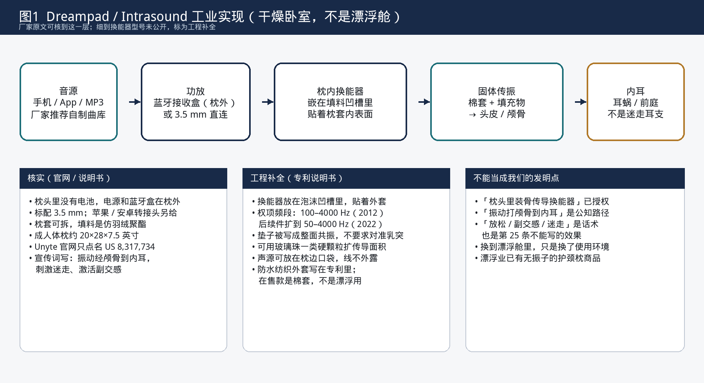
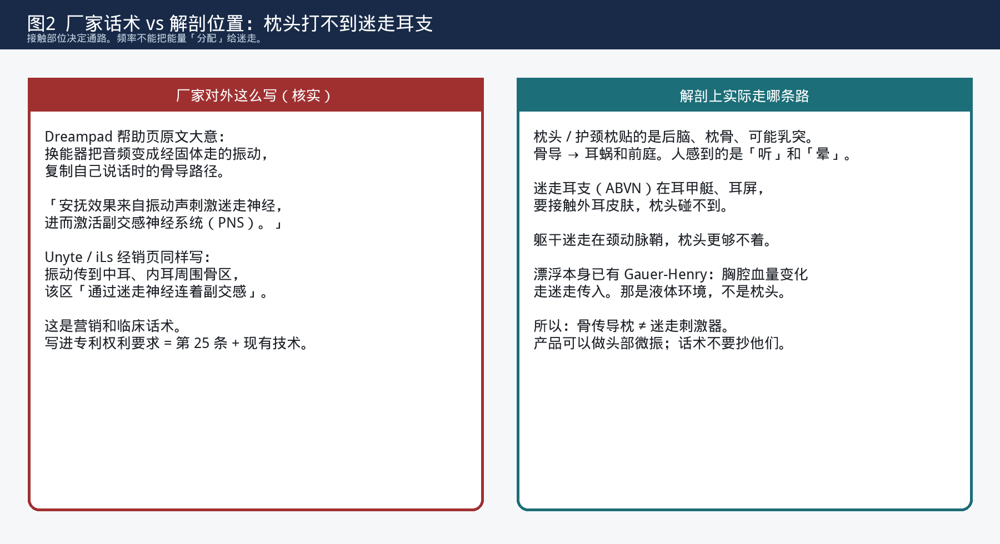
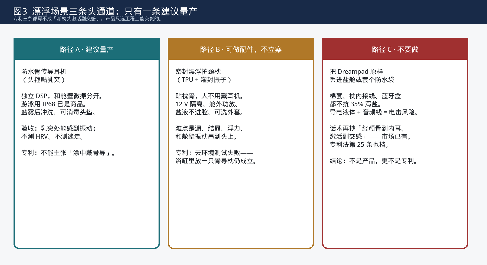

# Dreampad / Intrasound：公开拆解、漂浮枕工程、新专利可能性

内部检索评估｜2026-09-05  
公开渠道检索，法律状态未由代理师核验。不是授权结论，也不是自由实施意见。

给：产品、硬件、内容、专利。  
一句话：**骨传导振动枕已经有人在卖、有专利、话术直接写到副交感。漂浮舱里再做一只同类枕头，是产品配件问题，不是新专利。**

---

## 0. 结论先看

| 问题 | 答案 |
|---|---|
| Dreampad 是不是公开在售？ | 是。卧室骨传导枕，Shark Tank 上过，官网仍在卖。 |
| 他们是不是真的写了「经颅骨到内耳、作用于副交感」？ | 是。帮助页和经销页原文就是这么写的。见第 1 节。 |
| 「Intrasound 专利技术」有没有专利号？ | 有。Unyte 自己点名 **US 8,317,734**（骨传导垫，2012 授权）。同族后续还有 **US 11,528,547**（2022）等。见第 2 节。 |
| 中国有没有同族？ | 这次公开检索**没有**找到 Dreampad / Redfield 的中国同族。但中国采绝对新颖性：美国专利 + 官网 + 公开销售，一样是现有技术（`PAT-RULE-002`、`006`）。 |
| 漂浮舱里做一只骨传导枕头，工程上能不能做？ | 能做配件。建议优先继续用**防水骨传导耳机**当头通道；密封护颈枕可以当选配，不要当主路径。见第 4 节。 |
| 能不能就这个去申请新专利？ | **不能按「枕头振动 → 颅骨 → 内耳 → 迷走 / 副交感」去写。** 客体不过第 25 条，结构不过去环境测试，先案已经把垫/枕/50–4000 Hz 写进权项。见第 5 节。 |

入库：先案 `PAT-PRI-092`～`095`（核到公开号），打掉卡 `PAT-IDEA-061`。旧卡 `PAT-PRI-081` 补上专利号，不再写「待核验」。

---

## 1. 非专利公开：他们对外到底写了什么

判断标准是「有没有公开」，不是「有没有授权」。下面都是厂家或经销商自己的句子，不是我们的解读。

### 1.1 机制话术（核实）

Dreampad 帮助页 *What is Bone Conduction?*：

> 换能器把播放器的信号转成经固体传播的振动（而不是空气喇叭）。安抚效果来自这些振动声**刺激迷走神经，进而激活副交感神经系统（PNS）**。PNS 负责把人从过度唤起往下拉，才能放松睡着。

https://help.dreampadsleep.com/en-US/what-is-bone-conduction-184611

Unyte / Integrated Listening 经销页把路径写得更完整：

> Intrasound 用机电换能器把音乐电信号变成振动；振动经骨传到**中耳、内耳周围**（耳蜗 / 前庭），这一区**通过迷走神经连着副交感**。刺激副交感带来放松反应，有助于入睡、维持睡眠。

https://integratedlistening.com.au/products/28282-2/

FAQ 里同一套话再写一遍：骨导复制「自己说话时嗓子经骨到内耳」；音乐传到内耳后触发身体的放松反应，即副交感。  
https://dreampadsleep.com/pages/faq

**对我们的含义：** 「振动经颅骨传至内耳并作用于副交感」不是秘密，是竞品公开广告。投资材料如果还用同一套叙事，市场上没有独占性；写进专利说明书只会触发第 25 条和监管口径，没有排他收益。`PAT-PRI-081` 一开始就记了这一层，本报告把原文钉死。

### 1.2 商品形态（核实）

| 项 | 公开内容 |
|---|---|
| 品牌 | Dreampad，现属 Dreampad LLC / 与 Unyte Integrated Listening 同源 |
| 创始 | Randall Redfield；iLs 2008 年丹佛；产品先做儿童临床工具，2016 前后改成人睡眠枕 |
| 公开传播 | 2017 年 Shark Tank 未成交，但整套机制被电视公开 |
| 在售构成 | 枕内嵌 Intrasound 音频系统；**枕内无电池**；枕外蓝牙接收/功放；3.5 mm 直连；棉套 + 仿羽绒填料 |
| 成人枕尺寸 | 约 20 × 28 × 7.5 英寸 |
| 用法 | 头枕上去；也可另买薄垫塞到自己的枕头下面（Aurras） |
| 研究话术 | 引用 Columbia 等 HRV / 睡眠研究；当营销证据，不当专利授权依据 |

产品页：https://dreampadsleep.com/en-ca/products/dreampad-pillow  
专利声明页：https://integratedlistening.com/about/patents/

### 1.3 同一赛道上还有别人在卖

KARE Audio **Head Spot** 骨传导枕公开在售，宣传「振动经颅骨到内耳」，专利 **US 10,751,503**（`PAT-PRI-095`）。  
普通「声音枕」（枕内空气喇叭，如 US 9,433,744 一类）更早，走气导，不是骨导，但说明「枕里放发声器」本身毫无空白。

漂浮业已经有**无振子**的护颈枕：Dreampod **Halo Float Pillow**（机洗头枕，约 40 美元）。头通道如果只是「漂的时候垫一下脖子」，连振子都不必加。

---

## 2. 专利：Intrasound 不是商标空话

Unyte 专利页目前只挂一件。同族往下查，至少还有后续授权件。法律状态以 USPTO 登记为准，下表是公开检索结果。

| 公开号 | 标题 | 权利人 / 发明人 | 关键日期 | 独权在写什么 |
|---|---|---|---|---|
| **US 8,317,734 B1** | Bone conduction pad | Integrated Listening Systems；Redfield | 2009-06-19 申请，2012-11-27 授权；Google 标有效至约 2031-03-29 | 柔性垫 + 外套完全包住 + **骨传导换能器贴着外套、夹在垫面和外套之间**；发 **100–4000 Hz**；声源电连接；垫和外套配置成能把声波传到人的骨骼。枕头是实施例。 |
| **US 10,112,029 B2** | Bone conduction apparatus and multi-sensory brain integration method | iLs；Redfield / Minson | 2013-03-15 申请，2018-10-30 授权 | 独权是**治疗方法 + 气导/骨导耳机系统**（过滤音乐、无线、平衡板等）。说明书把垫/枕/头带/眼罩整套装置又写了一遍。治疗方法在中国本来就难授权。 |
| **US 11,528,547 B2** | Bone conduction apparatus | **Dreampad LLC**；Redfield / Renner | 优先权追溯到 2009-06-19；2020-10-21 申请，2022-12-13 授权；Google 标有效至约 2029-11-13 | 垫内换能器 **50–4000 Hz**；换能器耦合到垫上，使**整个上表面共振**；可无线接收、外套口袋装接收器。垫可放在枕头或床垫下面。 |
| 续案 US2023/0108706 A1 | 同上方向 | Dreampad LLC | 2022-12 提交 | 同族还在往后写，具体权项以授权文本为准。 |
| **US 10,751,503 B2**（另一家） | Bone conduction body support system | KARE, LLC；Philip Root | 2019 左右申请，2020 授权 | 枕头/坐垫里多只可换位骨导换能器，**50–4000 Hz**，无线 + USB 供电。说明骨导枕不是只有 Dreampad 一家。 |

说明书里已经写死的工业细节（工程补全，来自 US 8,317,734 正文，不是拆机）：

1. 外套，专利写成防水纺织物；换能器、线和声源都包在外套里，人不会被线缠住。
2. 泡沫或絮棉挖凹槽，换能器坐在槽里，周围有软过渡。
3. 可选硬颗粒填料（实施例：约 1/8 英寸玻璃珠）互相接触，把传导面积做大，换能器不必对准某一块骨头。
4. 声源是磁带/CD/MP3 一类播放器，后来的件改成无线。
5. 内容物：全频音乐、偏低频、滤掉高频、心跳声等「安抚」素材。
6. 形状不限于枕：床垫、毯子、婴儿垫、孕妇腹垫、头带、眼罩。

**对中国申请的意义：** 即使他们没在中国布局，上述美国文本和全球销售仍是现有技术。想在中国再写「一种骨传导枕头，换能器嵌在填料里，把头骨振动传到内耳」，没有空间。

入库卡：`PAT-PRI-092`（734）、`093`（547）、`094`（029）、`095`（503）。`PAT-PRI-081` 改为指向这些公开号。

---

## 3. 解剖：话术抄不得，通路也抄不到迷走

| 他们说的 | 物理上是什么 |
|---|---|
| 振动经颅骨到内耳 | 对。乳突 / 枕骨骨导是耳蜗通路。人听到的是骨导声，可能伴随前庭微扰。 |
| 因此刺激迷走、激活副交感 | **跳了一步。** 耳蜗不是迷走。迷走耳支（ABVN）在耳甲艇、耳屏，要接触外耳皮肤。枕头贴后脑，打不到。颈干迷走在动脉鞘里，更够不着。 |
| HRV 研究证明有效 | 最多是「枕着振动睡觉，某些人 HRV 有变化」。漂浮本身已有浸液引起的心肺容量感受传入（Gauer-Henry）。不能把枕头的骨导声说成迷走专属通道。 |

产品侧：对外只说「头部轻轻振一下，可以关掉」。不要写 激活迷走、音疗、40 Hz。  
专利侧：效果语言既是第 25 条，也是监管材料。交底书红线见 `PAT-WRITE-005`、`PAT-CLU-005`。

---

## 4. 骨传导漂浮枕头：工业实现方案

这一节是**产品研发**，不是交底书。漂浮舱里的头通道，要同时满足：高盐（约 35% 泻盐）、中性浮力、人戴耳塞、舱壁可能已经在微振。

### 4.1 路径 A · 建议作为默认头通道（已写进产品方案）

**防水骨传导耳机**，会话中可戴，独立功放 / DSP，不和舱壁共用一个全频信号。

| 项 | 做法 |
|---|---|
| 零件 | 消费级 IP68 游泳骨传导已是商品（如 OpenSwim 一类，`PAT-PRI-090`）。样机先买现成，再定自有头垫和线材。 |
| 接触 | 乳突或颧骨；夹持力可调，中性浮力下不能勒太阳穴。 |
| 电气 | 机内存储或舱外隔离功放；盐舱里不要走蓝牙当唯一路径。 |
| 卫生 | 头垫可换、可消毒；每次下机冲洗盐霜。 |
| 和体通道的关系 | 舱壁 25–80 Hz 宽带微振；头通道另开。默认关。见 `docs/双通道微振-产品研发方案.md`。 |
| 验收 | 乳突处刚过触觉阈；两路可分辨；深静音档不比现在差。不测 HRV。 |

这一条**不是新专利**，是把现成耳机接到现成舱上。要做的是夹持、消毒、盐雾和串扰，属于常规环境适配。

### 4.2 路径 B · 可选配件：密封骨导护颈枕

如果产品坚持「不要戴耳机、头还要另有一路振」，工业上做一只**漂浮护颈枕**，而不是把 Dreampad 扔进水里。

**结构（工程补全，样机用实测改）：**

1. **外套：** 食品接触级 TPU 或氯丁橡胶，可拆、可洗。对标 Halo Float Pillow 的「机洗头枕」，不要棉套。
2. **芯：** 闭孔泡沫，浮力按 FA-D/O 液面设计，让枕骨轻轻搁上、口鼻仍在水面以上。充气腔可以有，但振子不要放进会漏气的腔。
3. **振子：** 两只小型触觉换能器或激励器，**完全灌封**（环氧或硅胶），金属件用 316 或不锈钢。不要用 Clark AW339 那种说明书写明 *not for underwater* 的干侧件。
4. **安装：** 振子贴枕骨接触区的内壁，干腔里；线从枕尾部一根出，走舱沿到舱外功放。枕内无电池、无蓝牙模块。
5. **电气：** 舱外 Class D 功放，12 V SELV，漏电保护；音频地与舱体等电位。盐液导电，按湿区电器做，不按卧室枕头做。
6. **信号：** 独立通道。不要把舱壁那路低频再灌进枕头，否则头上变成「舱壁漏振 + 枕头」。需要的话在 DSP 里对头通道做高通，躲开体通道。
7. **卫生与寿命：** 盐霜会在缝里长硬壳。拉链、注胶口、出线孔是漏点。设计成可开盖换振子，或者整枕当耗材。

**样机 BOM 量级（估计）：** TPU 护颈枕体 1；灌封激励器 2（10–30 W / 4 Ω 这一档）；舱外 2×30 W 功放 1；隔离电源 1；硅胶出线 1；可洗外套 若干。单价远低于舱壁 Clark 方案，失效模式是漏和腐蚀，不是声学。

**不要做的：**

- 把 Dreampad 棉枕套个防水袋垫在脑后：耦合差、袋里冷凝、接头进盐。
- 枕内放锂电池或蓝牙盒。
- 用水下喇叭当「骨导枕」——那是液体传声，不是骨导，和 Clark AQ / Diluvio 一类混在一起。
- 对外写迷走、副交感、音疗。

### 4.3 路径 C · 明确不做

原样 Dreampad、任何枕内带电的消费枕头、以及「防水袋 + 卧室骨导枕」。盐舱里这是电气事故，不是创新。

### 4.4 和现有双通道方案怎么分工

| 通道 | 硬件 | 人感到什么 | 枕头加不加 |
|---|---|---|---|
| 体 | 舱外干侧触觉换能器打舱壁 | 胸腹四肢轻轻嗡 | 不加枕头 |
| 头（默认） | 骨传导耳机 | 乳突一带 | 不加枕头 |
| 头（选配） | 路径 B 护颈枕 | 后脑一带 | 给不爱戴耳机的人 |
| 深静音 | 全关 | 和现在一样 | 护颈枕仍可当无振子 Halo 用 |

枕头**替代不了**舱壁体通道：接触斑只在后脑，身体其余部分几乎没振。枕头也**替代不了**耳甲 taVNS：接触点不对。

---

## 5. 新专利可能性评估

四道闸门，缺一不可。概念按最容易被提出来的写法评估：

> 「一种漂浮舱用骨传导枕头，换能器把振动经颅骨传到内耳，刺激迷走 / 副交感，使人更放松。」

### 5.1 第 25 条（`PAT-RULE-004`）

刺激迷走、激活副交感、助眠、降焦虑，是对人体的方法或科学发现。装置可以写结构，但不能靠这个效果撑创造性。带「疗」字的整类已打掉（`PAT-IDEA-059`）。**这一条单独就否了话术型独权。**

### 5.2 现有技术（有没有公开，不看有没有在中国授权）

| 想主张的特征 | 谁已经公开了 |
|---|---|
| 枕头 / 垫里嵌骨传导换能器 | US 8,317,734 独权；商品 Dreampad |
| 50–4000 Hz 或 100–4000 Hz 骨导 | 734、547、503 权项 |
| 整面垫子共振，不必对准某块骨头 | US 11,528,547 独权 |
| 垫放在枕下或床下 | 547 摘要和说明书 |
| 无线接收器放在外套口袋 | 547 从权 |
| 振动经颅骨到内耳 | 734 说明书 + 所有骨导耳机说明书 + Head Spot 文案 |
| 因此放松 / 副交感 / 迷走 | Dreampad 帮助页、经销页、FAQ，2017 年电视已公开 |
| 人在液体里用骨导听东西 | 游泳骨传导耳机在售（`PAT-PRI-090`）；浴缸/水床双换能器（`PAT-PRI-089`） |
| 漂浮舱里有护颈枕 | Halo Float Pillow 在售（无振子，但「漂浮头枕」这个物体已有） |
| 漂浮舱壁已经在振 | Dreampod 等（`PAT-PRI-080`） |

组合「漂浮舱 + Dreampad 那种枕头」：审查指南里的简单叠加（`PAT-RULE-005`）。各模块仍按常规工作——枕头振头，舱壁振壳，盐液还是盐液。

### 5.3 去环境测试（`PAT-RULE-003`）

拿掉高盐、拿掉中性浮力、拿掉密闭门锁：浴缸或床上放一只骨导枕，结构还在，问题还在。说明高盐不是必要条件。  
高盐真正带来的新麻烦是：导电、腐蚀、结晶、舱壁振动经液体漏进颅骨。这些要么是常规防水电器，要么是组三已经在写的**工作液阻抗 / 腔体模态**（`PAT-IDEA-049`、`050`），轮不到枕头来立新案。

### 5.4 还能不能挤一条窄缝？

| 候选写法 | 过闸？ | 说明 |
|---|---|---|
| 骨导枕激活迷走 / 副交感 | 否 | 第 25 条 + 公开话术 |
| 漂浮专用骨导枕 | 否 | 去环境失败 + Halo/Dreampad/耳机叠加 |
| 枕头振子 + 舱壁振子双频 | 否 | 已打掉 `PAT-IDEA-060` |
| 灌封、12 V、可洗外套 | 否 | 常规防水与卫生设计 |
| 测乳突、把舱壁串扰从枕头里减掉 | 不建议 | 已知驱动的前馈抵消；骨导 ANC 已有 `PAT-PRI-073` |
| 组三：高盐液当阻抗层、腔模态 | 已有卡 | 与枕头无关，不要借枕头重写一遍 |

**立案建议：不立。** 打掉卡 `PAT-IDEA-061`。产品要做头通道，按第 4 节路径 A，选配路径 B，专利文件里不要出现本概念。

---

## 6. 对我们正在做的事怎么用

1. **产品：** 头通道继续走骨传导耳机。护颈枕如果做，定位是「不爱戴耳机的人的选配」，验收只测后脑能感到微振，默认关。
2. **文案：** 不要再用 Dreampad 那套「经颅骨 → 迷走 → 副交感」。对内假说可以留在实验笔记里；对外和专利都不写。
3. **专利：** 骨传导放松入口早已在 `PAT-IDEA-053` 打掉。本报告只是把 `PAT-PRI-081` 的「专利号待核验」补成具体公开号，并堵住「那我们做漂浮版枕头」这条退路。
4. **FTO：** 美国市场若销售骨导枕形态，需要代理师对 734 / 547 / 503 做权项对比（换能器是不是「夹在垫面和外套之间」、是不是「整面共振」）。耳机形态不在这几件独权中心。本文件不是 FTO。
5. **中国申请：** 没有找到他们的中国同族，不代表可以在中国再写一遍枕头。绝对新颖性看全球公开。

---

## 7. 来源

| 类型 | 地址或公开号 |
|---|---|
| 产品 | https://dreampadsleep.com/en-ca/products/dreampad-pillow |
| FAQ | https://dreampadsleep.com/pages/faq |
| 骨导帮助页 | https://help.dreampadsleep.com/en-US/what-is-bone-conduction-184611 |
| 经销 / Intrasound 正文 | https://integratedlistening.com.au/products/28282-2/ |
| Unyte 专利页 | https://integratedlistening.com/about/patents/ |
| US 8,317,734 B1 | https://patents.google.com/patent/US8317734B1 |
| US 11,528,547 B2 | https://patents.google.com/patent/US11528547B2 |
| US 10,112,029 B2 | https://patents.google.com/patent/US10112029B2 |
| US 10,751,503 B2 | KARE Head Spot |
| Halo Float Pillow | https://dream-pod.com/shop-all/supplies/halo-float-pillow/ |
| 库内旧卡 | `PAT-PRI-081`、`PAT-IDEA-053`、`PAT-IDEA-060` |
| 产品方案 | `docs/双通道微振-产品研发方案.md` |

---

## 8. 一句话

Dreampad 把骨传导枕头做成了商品，并把「振动经颅骨到内耳、作用于副交感」写成了广告。专利也不是口头禅：垫里夹换能器、50–4000 Hz、整面共振，都已经在授权文本里。漂浮舱要给头部一路微振，用防水骨传导耳机做，必要时做密封护颈枕配件；**不要把「漂浮版 Dreampad」当成新发明去写。**
